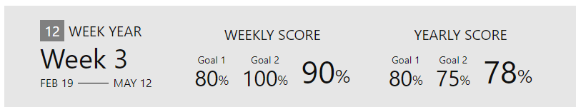

# 12 Week Year Obsidian Vault

This is a sample vault that shows how I keep track of the [12 week year](https://12weekyear.com/). In your weekly note this nice little widget is rendered showing you your progress on the 12 week year for this week and until this week.

## Step 1: Install Community Plugins (if you haven't already)
- Calendar
- **CustomJS**
- **Dataview**
- Periodic Notes
- Templater

CustomJS and Dataview are mandatory for the widget to work, the rest is optional.

## Step 2: Add customJS script
1. After you installed CustomJS, check the options to where the scripts need to be stored in your vault.
2. Copy the `12wy.js` from the `scripts` folder of the vault.

## Step 3: CSS
1. Copy css from `.obsidian/snippets/twy.css` to your `.obsidian/snippets` folder.
2. Activate it under Settings -> Appearance -> CSS Snippets
3. If you want to adjust the color, check out the first lines of the css. Set saturation to 30% and see what happens. Play around with [hue and saturation](https://developer.mozilla.org/en-US/docs/Web/CSS/color_value/hsl) to set the color.

## Step 4
Create your goals and think about what you want to do each week to make them happen.
Here are the two sample goals I used with assigned tactics:

#### Goal 1: Work out regulary
- Tactic 1: Go to the gym 3x per week
- Tactic 2: Go for a walk 2x per week

#### Goal 2: Keep a clean home
- Tactic 1: Vaccum whole appartment once per week
- Tactic 2: Mop the floors once per week
- Tactic 3: Change sheets once per week

## Step 5
Create your weekly schedule and distribute all your tactics to the different days of the week. Tag each task for goal 1 with `#12wyg1` and each task for goal 2 with `#12wyg2` and so on. 

Check out the daily template (`templates/daily.md`), where I have laid out a typical week for myself. `weekday() == 0` is Monday (or maybe Sunday in the imperical realm, you find out). The daily pages with the correct tasks for the day are then created by the template.

Not every week is the same, so adjust as you like when you get to the week. 

## Step 6
Check out the weekly template (`templates/weekly.md`). Adjust the start date of your 12 week year (`twystart`) and the number of goals that you have (`goals`). Copy the dataviewjs block to where you want the widget to appear in your weekly note, it doesn't have to be at the top.

## Some more details on how the algorithm works
The algorithm checks how many tasks tagged with `#12wyg1` you have in the current period and how many of them are done. This is done for each of the goals.

This also means that you can cancel plans and they are not negatively affecting your score. Let's say you want to keep a clean home, but one week you are on vacation, so no household chores are due. Just remove those tasks from the week and your yearly score is not affected. 

### The weekly score
This shows you how you have performed in the current week. If the current date is in the middle of the week (meaning you are looking at your current weekly page and it's e.g. Tuesday), the weekly score is calculated until the end of the current day. So you can reach 100% weekly score at the end of each day. I found it frustrating to having to work up to 100% during the week, because you are at, idk, 25% when you have finished every task for Monday and Tuesday, but really you have done 100% of the tasks.

### The yearly score
The widget shows how you have performed from the beginning of your 12 week year until the end of the current week (or, if you are in the middle of the week, until today). This is why the values of the yearly score are different week to week.

